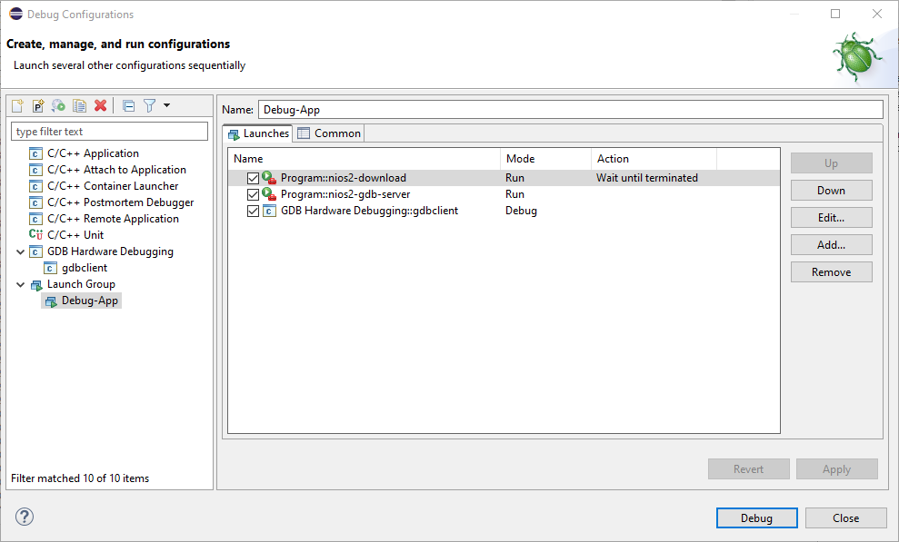
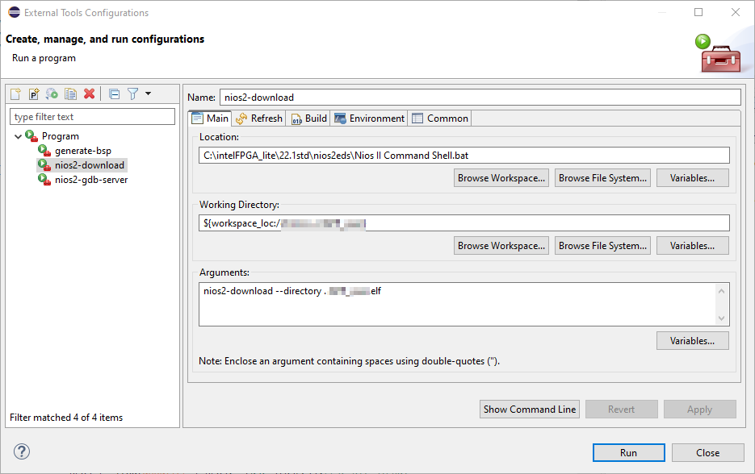
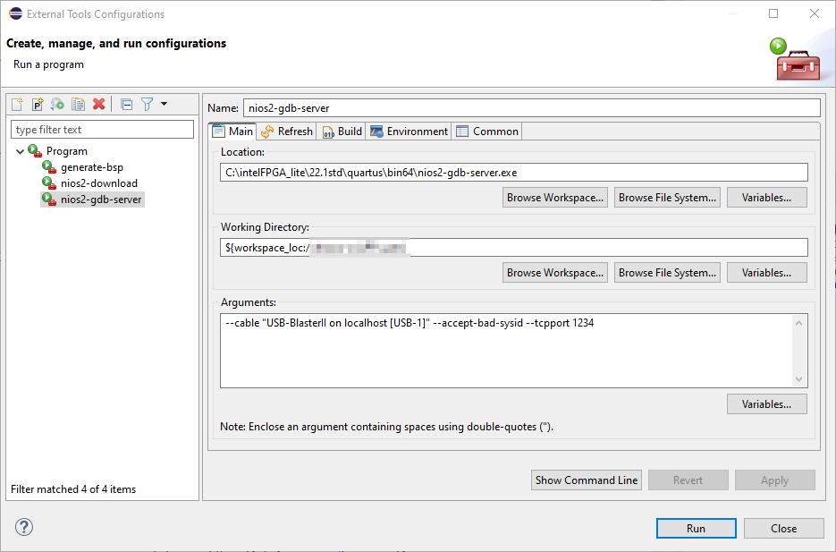
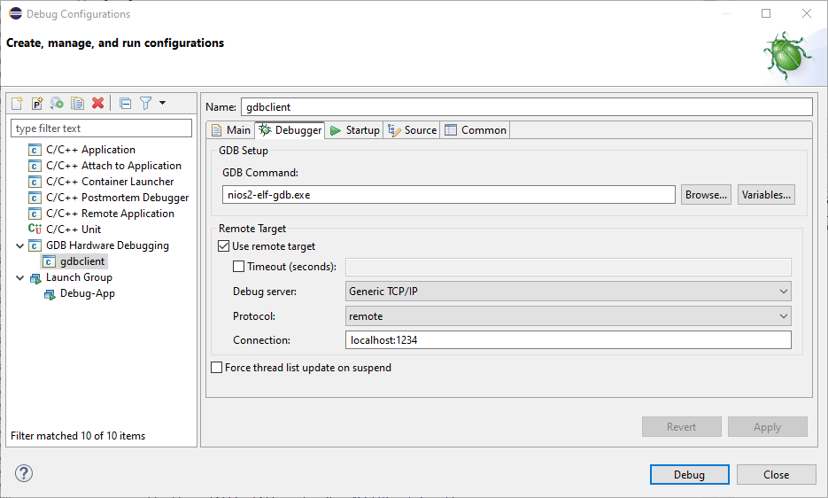
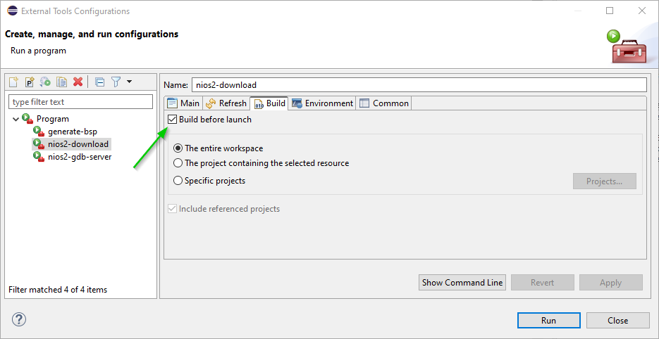
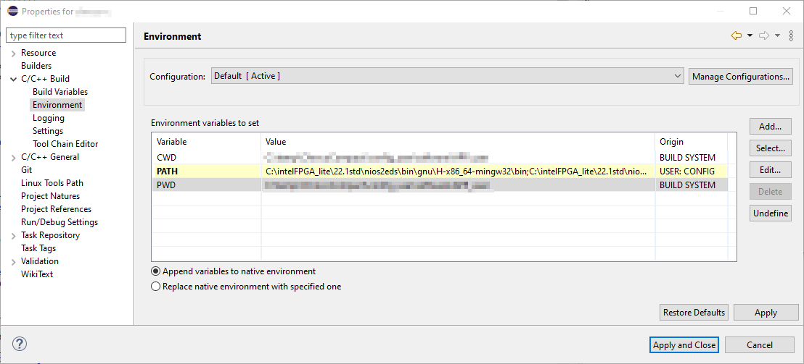
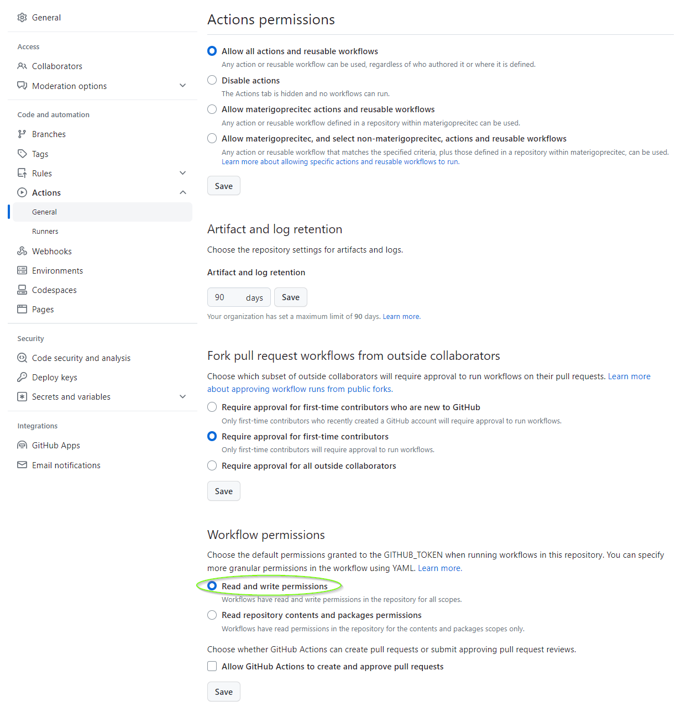

This project builds a GDB with enabled python for pretty printing targetting nios.
It is intended to replace the GDB found in Quartus-lite-22.1.0.842-windows but probably works with any v22.1

The executable runs on windows, required is at least Win10, as the msys UCRT64 is being used.
```
This GDB was configured as follows:
	configure --host=x86_64-w64-mingw32 --target=nios2-elf
		--with-auto-load-dir=$debugdir:$datadir/auto-load
		--with-auto-load-safe-path=/
		--with-expat
		--with-gdb-datadir=c:/intelfpga_lite/22.1std/nios2eds/bin/gnu/h-x86_64-mingw32/nios2-elf/share/gdb
		--with-jit-reader-dir=/ucrt64/lib/gdb (relocatable)
		--without-libunwind-ia64
		--with-lzma
		--without-babeltrace
		--without-intel-pt
		--with-mpfr
		--without-xxhash
		--with-python=D:/a/_temp/msys64/ucrt64
		--with-python-libdir=D:/a/_temp/msys64/ucrt64/lib
		--without-debuginfod
		--without-guile
		--disable-source-highlight
		--with-separate-debug-dir=/ucrt64/lib/debug (relocatable)
```
  

 It can replace the original GDB found in the nios installation.
 If quartus was installed with the default settings, then the artifact can just be copied over it.
This makes it possible to use pretty printing features, and or to use python scripting while debugging.

The standard eclipse shipped with altera quartus is not capable to display pretty-printing in the expression viewer.
So to have your Nios project running under modern conditions, make use of the latest eclipse c++ edition.
 
 To be able to load the target for debugging you need to make a command a launch group:
 
 It consists of the following settings:
 
 
 

Make sure that only the download step builds your project:

 
 In eclipse you also need to append the nios path so it can build your project.
Append the following to the PATH environment variable:

C:\intelFPGA_lite\22.1std\nios2eds\bin\gnu\H-x86_64-mingw32\bin;C:\intelFPGA_lite\22.1std\nios2eds\sdk2\bin;C:\intelFPGA_lite\22.1std\nios2eds\bin


You will also need a .gdbinit file with the content found in the repo.
Add the following config settings in your gdb settings


 If you wish to build it yourself on github after forking, then make sure you have the following permssions set in your github repo:


